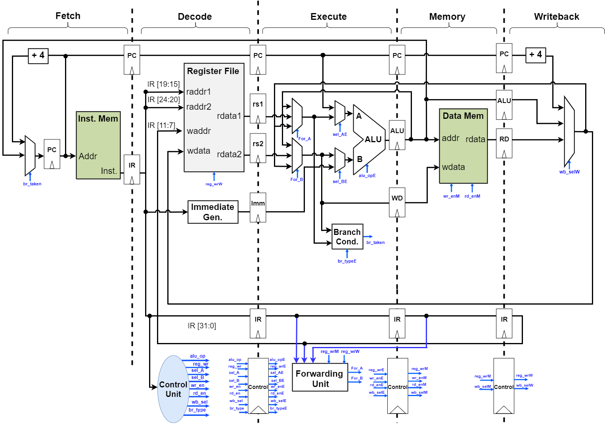

Author: Ali Imran

Registration: 2018-EE-062


All the test are written in the **test.py** in **tests** directory. Run the makefile to start the simulation. 

# Pipelined RISC-V Processor
## Phase 1
For the first phase of this project, we are going to  converting our [Single Cycle Processor](../Single-Cycle) to the pipelined version as shown in figure below.


For simulation, **cocotb** is used with **iverilog**.

For the five stages of the pipeline the four registers have been added which will not only propogate the inputs and outputs of each stage but will also propogate their control signals. The four registers have been added for the pipeline these registers are named as follows.

- [Decode Register](srcs/Decode.sv)
- [Execute Register](srcs/Execute.sv)
- [Memory Register](srcs/Memory.sv)
- [Writeback Register](srcs/Writeback.sv)

Following assembly code has been added in the **instruction_mem.mem** file to test the first phase of the pipeline.
```assembly
    addi x10,x0,10
    addi x11,x0,11
    addi x12,x0,12
    addi x13,x0,13
    addi x14,x0,14
    addi x15,x0,15
```
For the above code we have the following machine code.
```
00a00513
00b00593
00c00613
00d00693
00e00713
00f00793
```
We get the following output from our simulation.

## Phase 2
### Data Hazards
For phase 2, we are going to remove the data hazards first for which we are going to add the [Forwarding unit](srcs/forwarding_unit.sv). The forwarding unit compares the destination register of the previous and the second previous instruction with the source registers of the current instruction and forwards the ALU output from the memory and the writeback stage to the ALU inputs at the execution stage based on the comparison and the register write signals at the memory and writeback stage.


Following assembly code has been added in the **instruction_mem.mem** file to test the second phase of the pipeline.
```assembly
    addi x10,x0,10
    addi x11,x0,11
    add x12,x10,x11
```
For the above code we have the following machine code.
```
00000000
00a00513
00b00593
00b50633
```
We get the following output for the above assembly.

